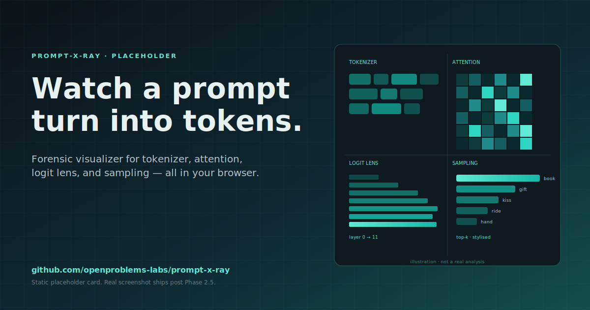

<div align="center">

# prompt-x-ray

**Paste a prompt. Get a forensic visualization of how the model processes it — entirely in your browser.**

[](LICENSE)
[](#tech-stack)
[](#privacy)
[](#privacy)
[](#whats-real-today-and-whats-not)

[**Live demo**](#-live-demo) · [**How to read**](HOW-TO-READ.md) · [**Limitations**](LIMITATIONS.md) · [**Roadmap**](#roadmap) · [**Companion repos**](#release-wave)

<sub>Repo #6 of the openproblems-labs week-1 wave — the post-mortem that pairs with <a href="#release-wave">attention-orrery</a>.</sub>

</div>

---

## TL;DR

> A side-by-side x-ray of any prompt across four synced panels — **tokenizer**, **attention**, **logit lens**, **sampling** — wired to one shared token-position axis. Click any token; every panel highlights it.

```
 ┌──────────────────── prompt-x-ray ────────────────────┐
 │                                                       │
 │   1. Tokenizer    ──▶  How is this prompt segmented?  │
 │   2. Attention    ──▶  Which tokens do heads focus?   │
 │   3. Logit lens   ──▶  Where does prediction form?    │
 │   4. Sampling     ──▶  What was almost said?          │
 │                                                       │
 │   ⇅ shared token-position axis across all four ⇅      │
 │                                                       │
 └───────────────────────────────────────────────────────┘
```

Everything runs on-device. No server, no telemetry, no prompt ever leaves your tab.

---

## ✦ Live demo

**[bettyguo.github.io/prompt-x-ray](https://bettyguo.github.io/prompt-x-ray/)** — published by [`.github/workflows/deploy.yml`](.github/workflows/deploy.yml) on every push to `main`. If a custom domain ships later, the workflow's `VITE_BASE` and `VITE_SITE_URL` env vars swap in one commit.

Or clone and run it locally — see [Quickstart](#quickstart).

<details>
<summary><b>Hero screenshot</b> · click to expand</summary>

_Hero screenshot pending — captured from a real analysis run after Phase 2.5
lands and all four panels render real data. The canonical example will be the
IOI ("John and Mary") prompt in the "all four" view. Until then, the
[panel-status table below](#whats-real-today-and-whats-not) is the truthful
picture._

</details>

---

## Demo

The canonical example is the **IOI ("John and Mary") prompt**:

> `John and Mary went to the shop. John gave Mary a`

<p align="left">
  
</p>

GIF captured post-Phase-2.5; in the meantime the
[What's real today](#whats-real-today-and-whats-not) section is the truthful
map of which panels render real data and which still show a capability note.

---

## Why prompt-x-ray exists

Most interpretability tooling is either:

- **a notebook** — powerful but high-friction; you need to clone, install, and know what you're looking for, or
- **a single-panel demo** — BertViz-style attention heatmaps, a tokenizer playground, a logit-lens widget — each useful in isolation, none integrated.

prompt-x-ray collapses all four into one forensic surface, **integrated** rather than juxtaposed:

| | Notebook (e.g. TransformerLens) | Single-panel demos | **prompt-x-ray** |
|---|:---:|:---:|:---:|
| In-browser, zero setup | ✗ | ~ | **✓** |
| Tokenizer view | ~ | sometimes | **✓** |
| Attention view | ✓ | one of several | **~** [^p25] |
| Logit lens | ✓ | rarely | **~** [^p25] |
| Top-k sampling | ✓ | sometimes | **✓** |
| **Shared position axis across views** | ✗ | ✗ | **✓** |
| Shareable URL per analysis | ✗ | ✗ | **✓** |
| Privacy (prompt never leaves device) | n/a | varies | **✓** |
| Fork-a-candidate to extend prompt | ✗ | ✗ | **✓** |

[^p25]: Panels exist and the shared axis already routes through them; real
    attention weights and intermediate hidden states arrive in Phase 2.5
    (see [What's real today](#whats-real-today-and-whats-not)).

The **shared axis** is the unlock. Highlighting position 7 in the tokenizer instantly tells you which attention column to look at, where the logit lens crystallizes, and which alternatives the sampler would have picked. That correlation across panels is the forensic part.

---

## The four panels

### 1 · Tokenizer
> **What it answers:** How does GPT-2 actually slice this prompt?

- Every BPE token rendered as a chip. Leading-space tokens marked with `·`, newlines with `↵`.
- **Chip shade** maps to GPT-2 vocab id (≈ frequency rank). Cool blue = common, warm amber = rare.
- **Amber ring** flags "surprising boundaries" — midword splits, low-frequency tokens, uncommon punctuation, byte fallbacks. Heuristics documented in [HOW-TO-READ.md](HOW-TO-READ.md).
- Hover for `pos · id · rank` + the full reason list.

### 2 · Attention
> **What it answers:** Which tokens does each head focus on?

- 12 × 12 head-summary grid (one cell per `layer × head`).
- Cell brightness encodes per-head **mean row entropy** — bright cells are sharp-focus heads, dark cells are diffuse.
- Hovered cells expand into a full Viridis heatmap of the head's attention matrix.
- **Auto-flagged heads** wear a teal ring if they match a known pattern: `low-entropy`, `previous-token` (induction), `bos-attractor`, `delimiter-attractor`.

### 3 · Logit lens
> **What it answers:** At which layer does the prediction crystallize?

- Layers × positions grid; layer 0 at the bottom, layer 11 at the top — so reading bottom-up traces the residual stream through depth.
- Each cell = the **top-1 next-token prediction** if the model had stopped at that layer.
- Cell brightness = probability of that prediction. Hover for top-3.
- The pedagogical payoff: noisy at L0–L3, syntactic at L4–L8, semantic at L9–L11. The point where the column stabilizes is **the crystallization point** — usually mid-late, occasionally surprisingly early.

### 4 · Sampling
> **What it answers:** What was almost said?

- Top-10 next-token candidates at the position after the prompt.
- Bar chart with linear ↔ log toggle (log surfaces the long tail).
- Footer reports cumulative mass: `Top-10 covers X%` — instant read on confident-vs-hedged.
- **Click a bar to fork:** the candidate is appended to the prompt and the analysis re-runs. Lets you walk a beam by hand.

---

## What's real today, and what's not

This repo is deliberately **honest about its phase**. [Anti-fabrication rule #1](#anti-fabrication-rules) forbids shipping synthetic-looking numbers in panels whose underlying data isn't actually wired up yet.

| Panel | Backed by real data today? | Why / how |
|---|:---:|---|
| Tokenizer | **Yes** | GPT-2 BPE via `@huggingface/transformers`; char-span recovery; surprising-boundary heuristics computed live. |
| Sampling | **Yes** | Top-k softmax over the final-position logit row from the standard ONNX export. |
| Attention | **Phase 2.5** | The `Xenova/gpt2` ONNX graph does **not** expose `attentions`. Unblock with a custom export, or a verified pure-JS forward pass. Panel shows a capability note in the meantime — never fake numbers. |
| Logit lens | **Phase 2.5** | Same blocker: no intermediate `hidden_states`. Same unblock. |

We could have shipped plausible-looking placeholder values in those two panels. We didn't. The capability gap is documented in [LIMITATIONS.md](LIMITATIONS.md) and the unblocking plan is scaffolded in [`src/lib/forwardPass.experimental.ts`](src/lib/forwardPass.experimental.ts).

---

## Quickstart

```bash
git clone https://github.com/openproblems-labs/prompt-x-ray
cd prompt-x-ray
npm install
npm run dev
```

The first analysis after page load downloads GPT-2 small (~250 MB) from the Hugging Face CDN; subsequent runs use your browser's cache. Per-prompt analyses are also cached in IndexedDB so revisiting a shared link is instant.

```bash
npm run build       # production bundle in dist/
npm run typecheck   # tsc -b --noEmit, zero errors
npm run preview     # serve the production build
```

---

## Try one of these prompts

Click any in the live demo's "Try one of these" gallery, or paste manually.
Each row's caption is a **hypothesis**, not a measurement — verifying these
against the live tool is one of the launch-day checklist items.

| Prompt | Hypothesis to verify |
|---|---|
| `John and Mary went to the shop. John gave Mary a` | The IOI benchmark — expect "Mary" to crystallize mid-to-late; attention literature suggests a few specific heads do the work. |
| `The capital of France is` | Factual recall — does "Paris" stay dominant from layer 0, or surface only late? |
| `A B C D A B C` | Induction-head signature on the repeated suffix. |
| `The the the the the the the the the` | One-token-dominates context — what does the sampler do? |
| `def fibonacci(n):\n    if n <= 1:\n        return` | Indentation + syntactic prior. Watch whitespace tokenization. |
| `2 + 2 =` | Tiny arithmetic. Does `4` really win the top-10? |
| `the capital of france is` | Lowercase trap — different tokenization, different ranking vs. the cased prompt. |
| `Paris is not the capital of` | Does negation surface early or late? |
| `English: hello\nFrench:` | Few-shot pattern; look for a colon-attractor head. |
| `Albert Einstein was a famous` | Compound entity — surprising-boundary ring on `Einstein`? |

Each is curated to produce a **visually striking** analysis — i.e. the kind of forensic finding worth tweeting.

---

## Privacy

| Property | This tool |
|---|---|
| Where the model runs | Your browser (WebAssembly / WebGPU via `onnxruntime-web`) |
| Where the prompt is sent | Nowhere |
| Where analyses are stored | Your browser's IndexedDB (so the next visit is instant) |
| What we (the maintainers) see | Nothing. There is no backend. |
| What share-links contain | The prompt itself, encoded `base64url`, in the URL — they go wherever you send them, but the maintainers' servers never see them. |

Model weights are fetched from Hugging Face's CDN on first use and cached by the browser. No analytics, no telemetry, no auth.

---

## Architecture

```
                       ┌──────────────────────────────┐
   Paste prompt  ───▶  │  PromptInput                 │
                       │  (textarea + ⌘↵ submit)      │
                       └──────────────┬───────────────┘
                                      ▼
                       ┌──────────────────────────────┐
                       │  analyzePrompt(text)         │
                       │  ───────────────────────     │
                       │  • IndexedDB cache lookup    │
                       │  • getModel() (singleton)    │
                       │  • tokenizePrompt            │
                       │  • model.forward → logits    │
                       │  • topKFromFinalLogits       │
                       │  • extractAttention   ◀── Phase 2.5
                       │  • extractLogitLens   ◀── Phase 2.5
                       │  • cache + return            │
                       └──────────────┬───────────────┘
                                      ▼
            ┌──── PromptAnalysis (shared types.ts) ────┐
            ▼              ▼              ▼            ▼
       Tokenizer       Attention      Logit lens   Sampling
                            ▲              ▲           ▲
                            └──────────────┴───────────┘
                       shared token-position axis (state/axis.ts)
                       hover/click in one ⇒ highlight in all
```

**Folder map**

```
src/
├── components/        # one file per panel + shell (Panel, PromptInput, ShareLink, …)
├── lib/
│   ├── modelLoader.ts        # singleton, broadcasts download progress
│   ├── tokenizer.ts          # BPE + char-span + surprising-boundary heuristics
│   ├── sampling.ts           # top-k softmax over final-position logits
│   ├── attentionExtract.ts   # currently returns {available:false} — Phase 2.5
│   ├── logitLens.ts          # currently returns {available:false} — Phase 2.5
│   ├── forwardPass.experimental.ts   # scaffolded pure-JS forward pass
│   ├── cache.ts              # IndexedDB analysis cache
│   ├── urlState.ts           # ?prompt=base64url share-link plumbing
│   └── analyzePrompt.ts      # the unified entry point
├── state/axis.ts      # cross-panel shared selection (subscribe API)
├── types.ts           # PromptAnalysis wire format
└── App.tsx            # default + "all four" view modes
```

---

## Tech stack

- **React 18 + TypeScript** — strict typing, no `any` in source
- **Vite** — fast dev server, fast prod build
- **Tailwind v4** — design tokens for the `ink-*`, `accent-*`, `warn-*`, `danger-*` palettes
- **D3** — `scaleLinear`, `scaleBand`, `scaleLog`, `interpolateLab`, `interpolateViridis`
- **@huggingface/transformers v3** — in-browser GPT-2 inference via ONNX runtime
- **No backend.** Static hosting only. Recommended targets: Vercel, Cloudflare Pages, GitHub Pages.

---

## Performance budget

| Metric | Target | Notes |
|---|---|---|
| Cold load → ready | **≤ 30 s on first visit** | Dominated by the one-time ~250 MB GPT-2 download from HF CDN. |
| Warm reload → ready | **≤ 2 s** | Model weights cached by the browser; analysis cached in IndexedDB. |
| Single-prompt analysis (≤ 64 tokens) | **≤ 3 s on a 2024 laptop** | Target only — no benchmark script in this tree yet (Phase 4 ships `scripts/bench.ts`). |
| Bundle size (JS, gzipped) | **≤ 350 kB** | **Measured:** first-paint JS is ~83 kB gzipped (`index` 14.4 kB + `react` 45.4 kB + `d3` 22.8 kB) from `npm run build` after the Wave-4 manualChunks split. The 234.7 kB `transformers` chunk loads lazily on the first Analyze click. |
| Hard prompt-length cap | **256 tokens** | Bounded by panel render time, not the model. |

Every "≤" row above is a **target**, not a measurement, except where explicitly
labelled "Measured". Phase 4 ships the benchmark script and replaces the
targets with real p50/p95 numbers in the [Benchmarks](#benchmarks) section.

---

## Benchmarks

_Pending Phase 4._ Once the Phase 2.5 forward pass lands and the integrated
path is stable, this section fills in with measured p50/p95 timings against
the three canonical prompts (IOI, factual, induction) on documented hardware.
The reproduction script will live at `scripts/bench.ts` (not yet present).

---

## Anti-fabrication rules

The whole project lives or dies on **whether the numbers it shows are real.** The master prompt encodes five guardrails; the codebase enforces them:

1. **All four panels show real data from the analyzed prompt.** When the data isn't available (Phase 2.5), the panel renders an honest capability note — never synthetic placeholders.
2. **Interesting-head flags are computed**, not curated.
3. **The hero screenshot is from a real analysis run**, not composited.
4. **Performance claims are measured** on documented hardware.
5. **Example prompts produce the analyses claimed** in the gallery — verified before launch.

---

## Roadmap

**Phase 2.5 (next)** — unblock the Attention + Logit-lens panels with real
attention weights and intermediate hidden states. Two routes; whichever
verifies numerically first wins.

**Phase 4** — performance pass, verified hero screenshot, crystallization-point
overlay on the logit lens.

**v2 candidates** — see [LIMITATIONS.md#roadmap-post-v1](LIMITATIONS.md#roadmap-post-v1)
for the canonical post-v1 list (multi-model, diff-two-prompts, SAE-feature
panel, MLP-level interpretability, live-as-you-type). Push priority by opening
an issue.

---

## Release wave

prompt-x-ray is one repo in a ten-repo openproblems-labs release. **Same teal accent, different surface.**

| | Repo | Pattern | Week | Surface |
|---|---|---|---|---|
| 1 | nano-sae | A (educational) | 1 — Mon | Sparse-autoencoder feature browser |
| 2 | attention-orrery | B (toy live) | 1 — Tue | Live attention surface, real-time |
| **3** | **prompt-x-ray** | **D (visualizer)** | **1 — Wed** | **Forensic post-mortem (this repo)** |
| 4 | steering-playground | D (visualizer) | 2 | Counterfactual steering |
| 5 | interp-golf | C (puzzle) | 2 | Mech-interp puzzles |
| 6 | policy-microscope | B (toy live) | 2 | Policy visualization |
| 7 | nano-mcp | A (educational) | 2 | Minimal MCP tutorial |
| 8 | llm-fossils | F (archive) | 3 | Historical model artifacts |
| 9 | emergence-museum | F (archive) | 3 | Curated emergence cases |
| 10 | mechanistic-detective | G (investigation) | 3 | Investigation flow on top of x-ray |

`attention-orrery` is the **live** model in motion. `prompt-x-ray` is the **post-mortem** of one prompt. Use them together.

---

## Contributing

Issues welcome; the open ones tagged `phase-2.5` or `good-first-issue` are the best entry point. Before opening a PR:

```bash
npm run typecheck   # must pass
npm run build       # must succeed
```

Visual changes should include a before/after screenshot in the PR description; functional changes should include a worked example prompt.

---

## Citation

If prompt-x-ray helped your work, please cite via [CITATION.cff](CITATION.cff).

```bibtex
@software{prompt_x_ray,
  title  = {prompt-x-ray: Forensic Visualization of Language Model Processing},
  year   = {2026},
  url    = {https://github.com/openproblems-labs/prompt-x-ray},
  license= {MIT}
}
```

---

## License

[MIT](LICENSE). Use freely; attribution appreciated.

---

<div align="center">

<sub>Built as the third pillar of the openproblems-labs week-1 release wave.</sub><br/>
<sub><b>Show me your weirdest prompt's x-ray</b> — open an issue tagged <code>gallery</code>; the best ones land in the curated examples.</sub>

</div>
